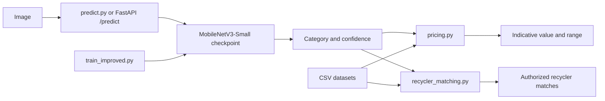

# ♻️ AI-Based E-Waste Classification & Value Estimation

**Turning an uploaded e-waste image into an explainable category, indicative value, and recycling direction.**

## 🚀 Overview

E-waste is difficult to sort consistently, value fairly, and route to an appropriate recycler. This Smart India Hackathon (SIH) 2026 project combines computer vision, Indian location-based pricing data, and recycler search into one Python-based workflow.

The system accepts an e-waste image, predicts one of 17 trained categories, reports the model confidence, estimates an indicative value from the supplied weight and location when price data is available, and finds authorized recyclers that accept the predicted material.

## 🎯 Problem Statement

- Manual e-waste identification is difficult and inconsistent.
- Different materials require different handling and recycling processes.
- People often do not know the approximate value of their e-waste.
- Finding a suitable, authorized recycler can be difficult.

## 💡 Our Solution

```text
Image Upload
    → AI Classification
    → Material / E-Waste Category
    → Confidence Score
    → Weight + Location
    → Price Estimation
    → Recycler Matching
```

## ✨ Key Features

- MobileNetV3-Small image classification through the improved training pipeline.
- 17 supported waste and e-waste categories.
- Top prediction confidence and top-three CLI predictions.
- Location-aware pricing using the available Indian category price data.
- Weight-based estimated value and an indicative value range.
- Safe no-price responses when a category has no direct pricing match.
- Recycler matching filtered to authorized recyclers and ranked using location and pickup signals.
- FastAPI backend with health and prediction endpoints.
- A Streamlit UI is part of the intended project workflow, but `app.py` is not present in this checkout yet.

## 🧠 Machine Learning Model

The improved training script uses **MobileNetV3-Small** with transfer learning. The pretrained feature extractor is initially frozen, the classifier head is trained, and the final feature blocks are then fine-tuned. MobileNetV3-Small was selected for its compact architecture and practical CPU-friendly inference profile.

Training includes:

- 224 x 224 image input.
- Random horizontal flips, rotation, resized crops, color jitter, and ImageNet normalization.
- A stratified 70% train, 15% validation, and 15% test split.
- Class-weighted cross-entropy loss with label smoothing.
- Validation-based checkpoint selection and early stopping during fine-tuning.
- CPU or CUDA execution depending on the available PyTorch device.

The legacy `train.py` script contains a separate lightweight CNN baseline. Use `train_improved.py` for the MobileNetV3-Small pipeline described here.

## 📊 Model Performance

The following figures are the project's reported evaluation results:

| Metric | Result |
| --- | ---: |
| Test accuracy | **92.25%** |
| Weighted precision | **92.42%** |
| Weighted recall | **92.25%** |
| Weighted F1-score | **92.25%** |

These metrics come from the project's evaluation results. The checked-in `reports/classification_report.txt` stores the displayed per-class report rounded to two decimal places; regenerate the reports with `train_improved.py` when producing a new model release so the checkpoint, `metrics.json`, and reports are from the same training run.

## 🗂️ Supported Categories

The trained image classifier supports exactly these 17 categories:

`Battery`, `Keyboard`, `Microwave`, `Mobile`, `Mouse`, `PCB`, `Player`, `Printer`, `Television`, `Washing Machine`, `cardboard`, `glass`, `metal`, `organic`, `paper`, `plastic`, `trash`.

`Cable` and `LCD` are not trained image classes in the current dataset.

## 🏗️ Project Architecture



- `train_improved.py`: trains and evaluates the MobileNetV3-Small model, then writes the checkpoint, metrics, classification report, and confusion matrix.
- `train.py`: trains the separate lightweight CNN baseline.
- `predict.py`: loads the checkpoint, predicts an image, prints the top three classes, and calls the pricing estimator.
- `pricing.py`: maps supported categories to the Indian price dataset and calculates median per-kilogram pricing, estimated value, and a range.
- `recycler_matching.py`: filters and ranks authorized recyclers by material acceptance, service area, and pickup availability.
- `api.py`: exposes `/health` and `/predict` through FastAPI.
- `app.py`: reserved for the Streamlit interface; it is not currently included in this checkout.
- `model/`: trained checkpoint and evaluation metrics.
- `data/`: pricing, material, recycler, and local training data.
- `reports/`: classification report, confusion matrix, and dataset audit artifacts.

## 📁 Project Structure

```text
ewaste_sih_ai/
├── api.py
├── predict.py
├── pricing.py
├── recycler_matching.py
├── train.py
├── train_improved.py
├── requirements.txt
├── data/
│   ├── material_dataset_rupee_fixed.csv
│   ├── price_dataset_india_locations.csv
│   ├── recycler_dataset_large.csv
│   └── balanced_waste_images/       # obtain separately; excluded from Git
├── model/
│   ├── ewaste_classifier.pt
│   └── metrics.json
├── reports/
│   ├── classification_report.txt
│   ├── confusion_matrix.png
│   ├── dataset_audit.json
│   └── dataset_summary.csv
└── test_images/
    └── battery_test.avif
```

## ⚙️ Installation

Run these commands in PowerShell after cloning:

```powershell
git clone https://github.com/<your-username>/<your-repository>.git
cd <your-repository>
py -m venv .venv
Set-ExecutionPolicy -Scope Process -ExecutionPolicy RemoteSigned
.\.venv\Scripts\Activate.ps1
python -m pip install --upgrade pip
python -m pip install -r requirements.txt
```

The training image archive and extracted image directory are excluded from Git because of their size. Place the extracted dataset at `data\balanced_waste_images\` before training.

## ▶️ Usage

Run commands from the repository root.

### Terminal prediction

```powershell
python predict.py ".\test_images\battery_test.avif" --location Bhopal --weight 1
```

The CLI prints the predicted category, confidence, top three predictions, price per kilogram, estimated value, and available range.

### FastAPI backend

```powershell
uvicorn api:app --reload
```

Open the interactive Swagger documentation at <http://127.0.0.1:8000/docs>.

Check service health:

```powershell
curl.exe http://127.0.0.1:8000/health
```

Submit an image with location and weight:

```powershell
curl.exe -X POST "http://127.0.0.1:8000/predict?location=Delhi&weight_kg=2" `
  -F "file=@.\test_images\battery_test.avif"
```

`POST /predict` accepts an image upload and optional `location` and `weight_kg` query parameters. Its response includes the category, confidence, pricing result, and recycler matches.

### Streamlit application

No `app.py` or Streamlit dependency is currently present in the repository, so there is no verified Streamlit launch command for this checkout. Once the UI file is added, its command should be documented here after it has been tested.

## 🧪 Example Prediction

The following is an illustrative example for a PCB image. Values are examples, not a guaranteed output:

```text
Image: .\test_images\pcb_example.jpg
Predicted category: PCB
Confidence: 94.10%                 # example
Weight: 0.75 kg                     # example input
Location: Bhopal                    # example input
Estimated price: ₹1,350.00         # example output
Estimated range: ₹1,125.00-₹1,575.00  # example output
```

Actual results depend on the image, model checkpoint, selected location, weight, and available pricing rows.

## 💰 Pricing System

`pricing.py` reads `data/price_dataset_india_locations.csv` and maps only categories with a direct, explicitly configured match. It first looks for the requested location and falls back to all rows for that category when the location has no matching row.

For available pricing data, it returns the median price per kilogram, multiplies it by the supplied weight, and provides a minimum-to-maximum value range. Categories without a safe direct mapping return `no_direct_price` instead of inventing a price. A category with no matching pricing rows returns `no_price_data`.

## ♻️ Recycler Matching

`recycler_matching.py` reads `data/recycler_dataset_large.csv`. It:

1. Maps `glass`, `metal`, and `plastic` to the material labels used by the recycler dataset.
2. Keeps recyclers whose accepted-materials field contains the target material.
3. Keeps records marked as authorized.
4. Adds points for a matching service area and pickup availability.
5. Returns up to five matches sorted by score and recycler ID.

The API includes these records in the `recycler_matches` response field.

## 📈 Evaluation & Reports

- `model/metrics.json`: training configuration and final metric values written by `train_improved.py`.
- `reports/classification_report.txt`: per-class precision, recall, F1-score, and support.
- `reports/confusion_matrix.png`: generated confusion matrix for the test split.
- `reports/dataset_audit.json` and `reports/dataset_summary.csv`: dataset review artifacts.

## 🔮 Future Improvements

- Add more varied real-world images and lighting conditions.
- Add Cable and LCD classes after collecting and validating training data.
- Improve detection of real-world batteries and visually similar items.
- Add object detection for images containing multiple e-waste items.
- Integrate live recycler availability and verification.
- Support GPS or device geolocation.
- Connect to real-time market pricing.
- Build and test a mobile application.
- Deploy the service to the cloud.

## 🛡️ Limitations

- Test-set performance may not represent performance on uncontrolled real-world images.
- Pricing is indicative and depends on the available Indian location/category dataset.
- The classifier supports only the 17 categories listed above.
- A single image is treated as a classification input; multiple objects are not separately detected.
- Recycler results depend on the completeness and freshness of the local recycler CSV.
- The current checkout does not include the planned Streamlit `app.py` interface.

## 🤝 Team / SIH

This project was developed for **Smart India Hackathon 2026** under the e-waste management, artificial intelligence, and machine learning domain. 

## 📜 License

No license has been selected for this repository yet. Add a license before accepting external contributions or redistributing the project.

## ⭐ Conclusion

This project demonstrates how AI can make e-waste identification, indicative valuation, and responsible recycling more accessible through one practical workflow.
